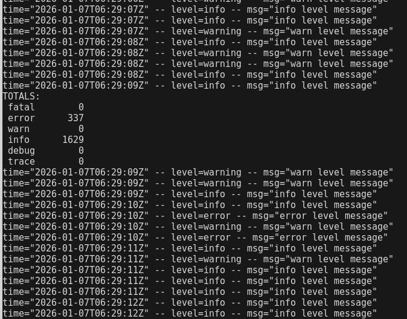

# Overview

The goal of this project is to be able to execute this utility to watch and react to events that occur in a deployed Kubernetes service's logs.

For now this looks like simply connecting to the pod in question, capturing the log stream,  and parsing to get totals.

But eventually I would like build something more interesting that might use capable Golang libraries to render a visually appealing Text User Interface (TUI).

For now it looks like:



This is an early proof-of-concept that runs off of the following:

- LoggingMockService
https://github.com/robojandro/loggingmockservice

Load the image so that kubectl can find it:
```
minikube image load logging-mock-service:latest
```

Apply the pod yaml through kubectl to get the logging service running:
```
kubectl apply -f pod.yaml
```

Finally, execute this process:
```
go run main.go
```

The service will log approximately 20000 lines, exit, and then restart.

### Related:
- Kubernetes
- Minikube
- Docker
- Stern
